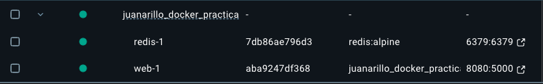
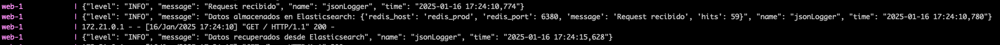
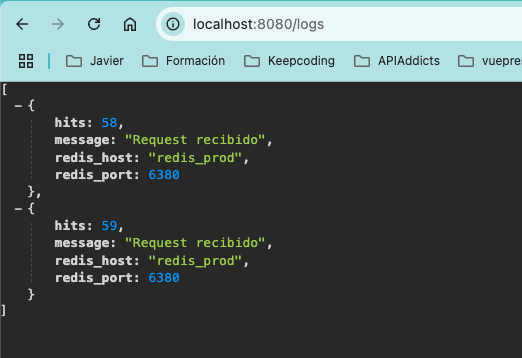
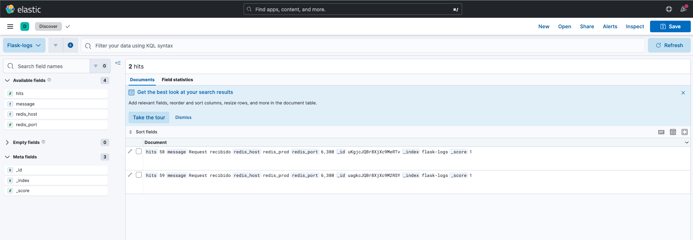

# PRÁCTICA CONTENEDORES: MÁS QUE VMS DOCKER - JUAN ARILLO
Práctica de Juan Arillo para el módulo de **Contenedores: Más que VMs Docker** a la nube.

## TABLA DE CONTENIDOS
[Descripción](#descripción)  
[Funcionamiento](#funcionamiento)  
[Puesta en marcha](#puesta-en-marcha)

## DESCRIPCIÓN
Este proyecto despliega una aplicación *Flask* que trabaja sobre una base de datos *Redis*.  

La aplicación *Flask* muestra un texto con los datos del *Host* y del *Puerto* donde se despliega el servicio de la
base de datos *Redis*, más un texto que muestra las veces que se ha cargado la página principal de la aplicación.

El servicio de la base de datos *Redis*, sirve como persistencia del número de veces que se visita la página principal
de la aplicación.

Adicionalmente, se han añadido logs a la aplicación para que salga por STDOUT / STDERR, así como el guardado
de estos logs en un servicio *ElasticSearch*, a los cuales se pueden acceder a través de una ruta añadida a la aplicación
*Flask*.

Por último, también se despliega un servicio *Kibana* para trabajar con la información de los logs guardados en el
servicio *ElasticSearch*.

## FUNCIONAMIENTO
Se ha creado una imagen de la aplicación *Flask* (cuyo `Dockerfile` se puede ver en el repositorio), que se ha subido a un repositorio *docker hub*. Esta imagen se usa posteriormente en el fichero `docker-compose.yml` para el despliegue de la aplicación. Esta imagen, junto con la información del `Dockerfile` empleado, se puede ver en esta dirección: https://hub.docker.com/repository/docker/juanarillo/docker_practica/general .  

El despliegue de los servicios se realiza a traves de *docker compose* usando el fichero `docker-compose.yml`, donde se ha configurado el despliegue de los siguientes servicios:  

- web: Aplicación Flask cuyo código se encuentra en el fichero `app.py`. Se usa la imagen personalizada que ha sido subida a [*Docker hub*](https://hub.docker.com/repository/docker/juanarillo/docker_practica/general). Se expone en el puerto `8080` y está configurado para admitir modificaciones en caliente del código, sin tener que desplegar de nuevo.
- redis: Servicio de persistencia del número de veces que se visita la página principal de la aplicación. Está configurado para recibir por parámetros el *HOST* y el *PORT*. Se le han activado los logs a nivel STDOUT / STDERR y se ha establecido un volumen para guardar los datos cuando se paren los servicios.
- elasticsearch: Servicio para almacenar los logs que se generan en la aplicación. También se ha creado un volumen para su persistencia aunque se paren los servicios.
- kibana: Servicio para la monitorización de los logs almacenados en el servicio *ElasticSearch*.

Una vez desplegado los servicios, se podrá acceder a la url [`http://localhost:8080`](http://localhost:8080) donde se mostrará el texto con el host y el puerto del servicio *Redis* según el fichero `.env` empleado, y el número de visitas.  

También se podrá comprobar que los puertos del servicio *Redis* son los establecidos en el fichero de entorno seleccionado (`.env.dev` o `.env.prod`).

A medida que se va accediendo a la ruta de la aplicación, se va actualizando el contador. Esto podremos comprobarlo en los logs de *Flask*, donde se mostrará dicha actualización y su persistencia en el servicio *ElasticSearch*. También se mostrarán logs cuando se consulten los logs almacenados.

También podremos ver los logs almacenados en el servicio *ElasticSearch*. Se ha creado una ruta en la aplicación para dicha consulta. Se pueden ver los logs accediendo a [`http://localhost:8080/logs`](http://localhost:8080/logs), obteniendo el siguiente resultado:

Por último se ha creado un servicio *Kibana* en el que podemos monitorizar, de una manera más dinámica, nuestros registros de logs.

## PUESTA EN MARCHA
