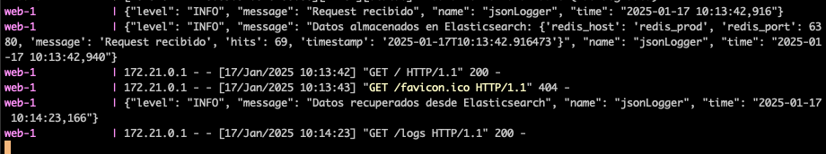
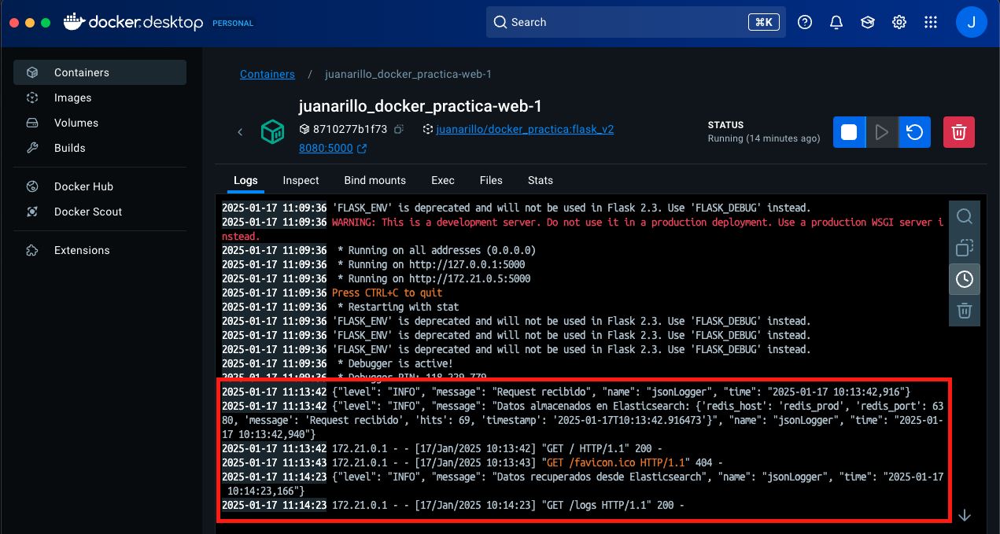

# PRÁCTICA CONTENEDORES: MÁS QUE VMS DOCKER - JUAN ARILLO

Práctica de Juan Arillo para el módulo de **Contenedores: Más que VMs Docker** a la nube.

## TABLA DE CONTENIDOS

[Descripción](#descripción)  
[Funcionamiento](#funcionamiento)  
[Puesta en marcha](#puesta-en-marcha)

## DESCRIPCIÓN

Este proyecto despliega una aplicación *Flask* que trabaja sobre una base de datos *Redis*.  

La aplicación *Flask* muestra un texto con los datos del *Host* y del *Puerto* donde se despliega el servicio de la
base de datos *Redis*, más un texto que muestra las veces que se ha cargado la página principal de la aplicación.

El servicio de la base de datos *Redis*, sirve como persistencia del número de veces que se visita la página principal
de la aplicación.

Adicionalmente, se han añadido logs a la aplicación para que salga por STDOUT / STDERR, así como el guardado
de estos logs en un servicio *ElasticSearch*, a los cuales se pueden acceder a través de una ruta añadida a la aplicación
*Flask*.

Por último, también se despliega un servicio *Kibana* para trabajar con la información de los logs guardados en el
servicio *ElasticSearch*.

## FUNCIONAMIENTO

Se ha creado una imagen de la aplicación *Flask* (cuyo `Dockerfile` se puede ver en el repositorio), que se ha subido a un repositorio *docker hub*. Esta imagen se usa posteriormente en el fichero `docker-compose.yml` para el despliegue de la aplicación. Esta imagen, junto con la información del `Dockerfile` empleado, se puede ver en esta dirección: https://hub.docker.com/repository/docker/juanarillo/docker_practica/general .  

El despliegue de los servicios se realiza a traves de *docker compose* usando el fichero `docker-compose.yml`, donde se ha configurado el despliegue de los siguientes servicios:  

- **web**: Aplicación Flask cuyo código se encuentra en el fichero `app.py`. Se usa la imagen personalizada que ha sido subida a [*Docker hub*](https://hub.docker.com/repository/docker/juanarillo/docker_practica/general). Se expone en el puerto `8080` y está configurado para admitir modificaciones en caliente del código, sin tener que desplegar de nuevo.
- **redis**: Servicio de persistencia del número de veces que se visita la página principal de la aplicación. Está configurado para recibir por parámetros el *HOST* y el *PORT*. Se le han activado los logs a nivel STDOUT / STDERR y se ha establecido un volumen para guardar los datos cuando se paren los servicios.
- **elasticsearch**: Servicio para almacenar los logs que se generan en la aplicación. También se ha creado un volumen para su persistencia aunque se paren los servicios.
- **kibana**: Servicio para la monitorización de los logs almacenados en el servicio *ElasticSearch*.

Una vez desplegado los servicios, se podrá acceder a la url [`http://localhost:8080`](http://localhost:8080) donde se mostrará el texto con el host y el puerto del servicio *Redis* según el fichero `.env` empleado, y el número de visitas.  


También se podrá comprobar que los puertos del servicio *Redis* son los establecidos en el fichero de entorno seleccionado (`.env.dev` o `.env.prod`).


A medida que se va accediendo a la ruta de la aplicación, se va actualizando el contador. Esto podremos comprobarlo en los logs de *Flask*, donde se mostrará dicha actualización y su persistencia en el servicio *ElasticSearch*. También se mostrarán logs cuando se consulten los logs almacenados.



También podremos ver los logs almacenados en el servicio *ElasticSearch*. Se ha creado una ruta en la aplicación para dicha consulta. Se pueden ver los logs accediendo a [`http://localhost:8080/logs`](http://localhost:8080/logs), obteniendo el siguiente resultado:


Por último se ha creado un servicio *Kibana* en el que podemos monitorizar, de una manera más dinámica, nuestros registros de logs. Se podrá acceder a través de la url [`http://localhost:5601`](http://localhost:5601)


## PUESTA EN MARCHA

1- Requisitos previos -> Tener instalado **git** y **docker** en el ordenador.  
2- Descarga del repositorio -> Abrir un terminal en el ordenador y clonar el repositorio.  

```bash
git clone git@github.com:KeepCodingCloudDevops11/juanarillo_docker_practica.git
```

3- Acceder a la carpeta con el proyecto.

```bash
cd juanarillo_docker_practica
```

4- Copiar en esta carpeta los ficheros `.env.dev` y `.env.prod` que se le han debido proporcionar.  
5- Desplegar la aplicación y los servicios usando las variables de entorno que se deseen mediante *docker compose*:

```bash
ENV_FILE=.env.dev docker-compose --env-file .env.dev  up --build # Para desplegar con las variables del fichero .env.dev
ENV_FILE=.env.prod docker-compose --env-file .env.prod  up --build # Para desplegar con las variables del fichero .env.prod

# ENV_FILE pasa los parámetros a la aplicación Flask
# --env-file pasa los parámetros al fichero docker-compose.yml
```

6- Comprobar que los servicios se han levantado y funciona correctamente:  
    - Se puede acceder a [`http://localhost:8080`](http://localhost:8080) .  
    - El texto de esta página muestra correctamente el *host* y el *port* establecido en las variables del fichero `.env` .  
    - El puerto en el que se ha desplegado el servicio *Redis* corresponde al establecido en el fichero `.env` desplegado. Se puede ver en la aplicación *Github desktop* o mediante el listado en consola de los contenedores activos usando el terminal `docker ps` .   
    - También podrá verse en la terminal o en la pestaña de *Logs* de la aplicación *Flask* (**web** en este caso) en *Github Desktop*, los logs de haber accedido a la aplicación y haberse almacenado los datos en el servicio **Elastic Search**.     
    - Podemos comprobar que los logs han sido realmente guardados en el servicio *ElasticSearch*, accediendo a la ruta [`http://localhost:8080/logs`](http://localhost:8080/logs), que se ha definido en la aplicación.  
    - Comprobar que el servicio *Kibana* está funcionando, mediante el acceso a [`http://localhost:5601`](http://localhost:5601).

7- Parar los servicios -> Hay dos posibilidades.  
    - Si se ha dejado corriendo en la terminal, pulsando la combinación `CTRL+C` para los contenedores.  
    - A través del terminal usando el comando `stop` de *Docker*.

```bash
# Hay que situarse en la carpeta desde la que se ha lanzado el docker compose, ya que tendremos que indicar el fichero .env con el que se lanzó inicialmente.

docker compose --env-file .env.prod stop
```

8- Eliminar los contenedores -> En la terminal, habrá que lanzar el comando de apagado, **pero indicando el fichero `.env` empleado**, porque si no, no reconoce que contenedores son los que hay que eliminar.

```bash
# Hay que situarse en la carpeta desde la que se ha lanzado el docker compose, ya que tendremos que indicar el fichero .env con el que se lanzó inicialmente.

docker-compose --env-file .env.prod down
```
